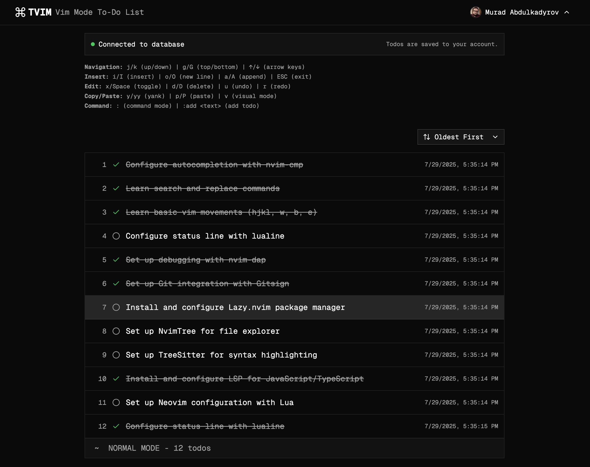

<a href="https://tvim.vercel.app">

  <h1 align="center">TVIM</h1>
</a>

<p align="center">
  Modern To Do List with Vim Commands
</p>

<p align="center">
  <a href="#features"><strong>Features</strong></a> ·
  <a href="#deploy-your-own"><strong>Deploy your own</strong></a> ·
  <a href="#running-locally"><strong>Running locally</strong></a>
</p>
<br/>

## Features

- [Tanstack Start](https://tanstack.com/start/latest)
  - File-based routing, type-safe from server to client
  - Built on Vite for a lightning-fast HMR development experience
- [Supabase](https://supabase.com)
  - Instant, hosted Postgres database with authentication and storage
  - Used for real-time syncing of tasks, user authentication, and data storage
- [Drizzle](https://orm.drizzle.team)
  - Type-safe SQL ORM for TypeScript
  - Used for database schema migrations and type-safe queries
- [Better Auth](https://github.com/murabcd/better-auth)
  - Simple, modern authentication for full-stack TypeScript apps
  - Used for secure, extensible authentication flows

## Deploy your own

You can deploy your own version of TVIM to Vercel with one click:

[](https://vercel.com/new/clone?repository-url=https%3A%2F%2Fgithub.com%2Fmurabcd%2Ftvim&env=DATABASE_URL&envDescription=Learn%20more%20about%20how%20to%20get%20the%20database%20URL%20for%20the%20application&envLink=https%3A%2F%2Fgithub.com%2Fmurabcd%2Ftvim%2Fblob%2Fmain%2FREADME.md&demo-title=TVIM&demo-description=Modern%20To%20Do%20List%20with%20Vim%20Commands%20built%20with%20Tanstack%20Start%2C%20Supabase%2C%20and%20Drizzle.&demo-url=https%3A%2F%2Ftvim.vercel.app)

## Running locally

You will need to use the environment variables [defined in `.env.example`](.env.example) to run TVIM. It's recommended you use [Vercel Environment Variables](https://vercel.com/docs/projects/environment-variables) for this, but a `.env` file is all that is necessary.

> Note: You should not commit your `.env` file or it will expose secrets that will allow others to control access to your various accounts.

1. Install Vercel CLI: `bun i -g vercel`
2. Link local instance with Vercel and GitHub accounts (creates `.vercel` directory): `vercel link`
3. Download your environment variables: `vercel env pull`

```bash
bun install
bun dev
```

Your app should now be running on [localhost:3000](http://localhost:3000/)